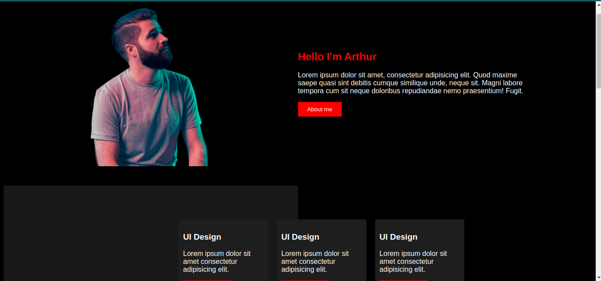
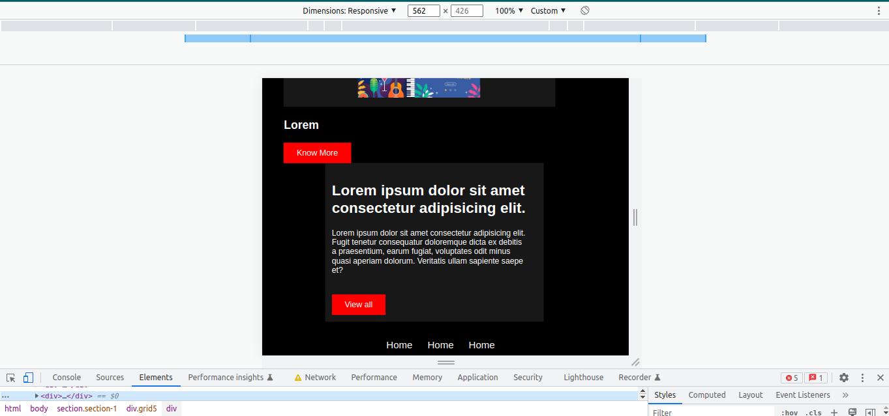

# I am Abhishek Singh
_I am learning Full stack javascript Development_

## This is the assignment that is the part of our live course.
### In this project  I used flex property .
###  The card is  made throgh the grid.
### The image card also made with grid.
### This is responsive for all screen size

### And learned about more how position works over an image.

### This is the landing page given to us to convert with using HTML and CSS


# Project 15
1. Developer Landing page 

# Technology used:
1. ```HTML5```
1. ```CSS3```

# Deployed Link
[Netlify Link](https://developer-landings-pages.netlify.app/)







# Time Taken To Complete This project

_9hours_ 